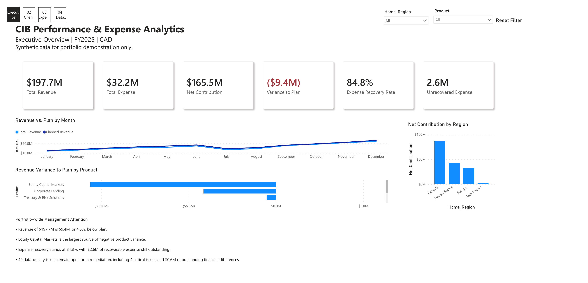
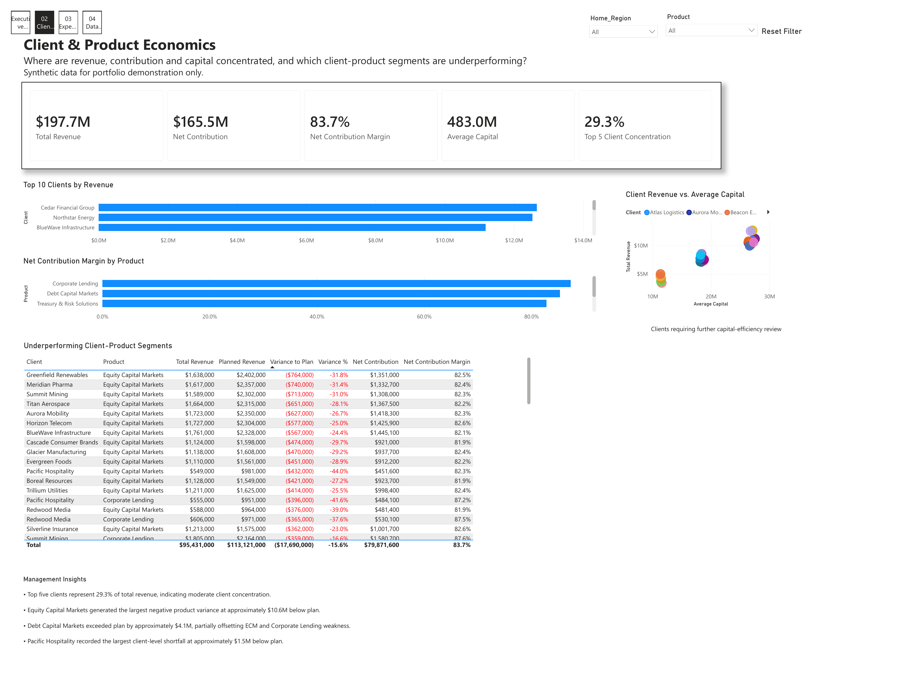
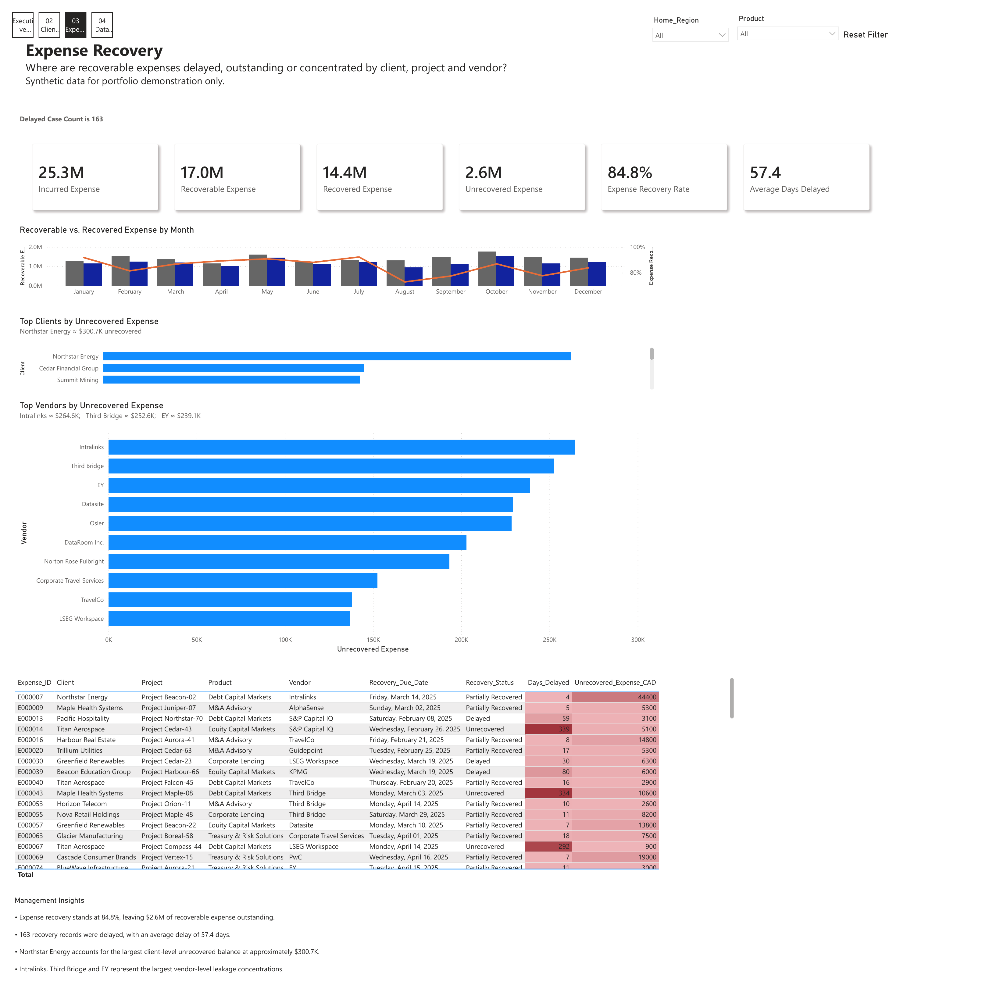
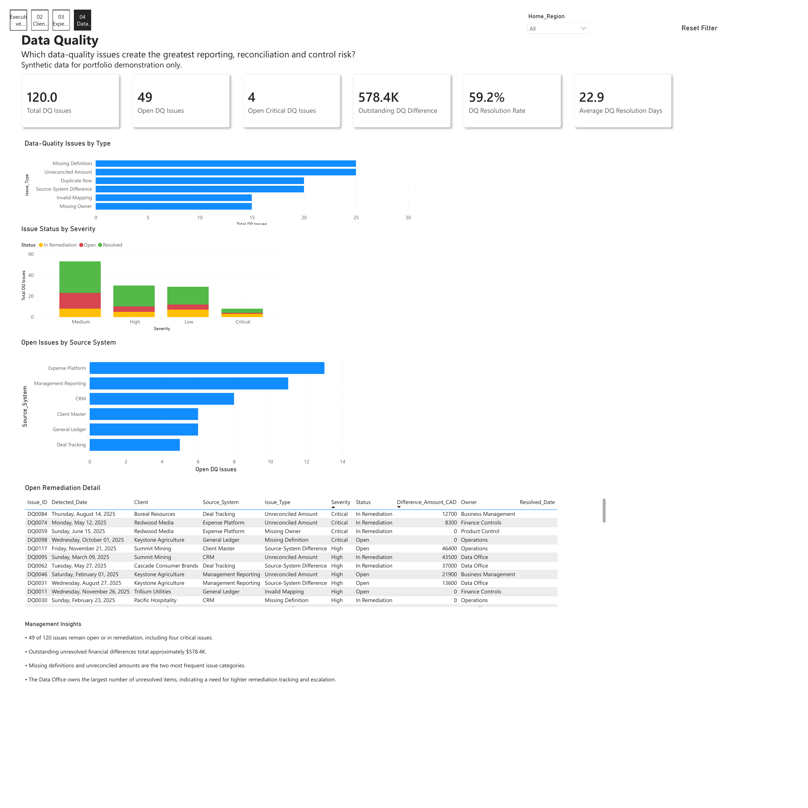
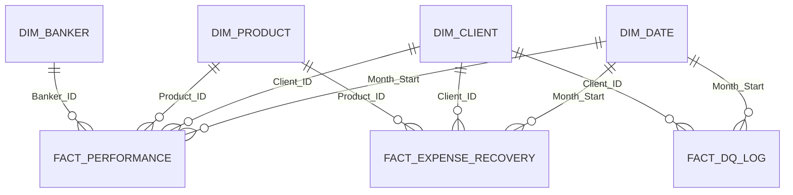

# CIB Performance & Expense Analytics

A synthetic **FY2025 CIB management-reporting case study** built in Power BI to analyze revenue performance, client and product economics, expense recovery, and data-quality risk.

**Power BI · DAX · Power Query · SQL · Excel**

[View dashboard PDF](docs/CIB_Performance_Expense_Analytics_FY2025.pdf) ·
[Download Power BI file](powerbi/CIB_Performance_Expense_Analytics_FY2025.pbix) ·
[Open source data](data/CIB_Performance_Expense_Analytics_Synthetic_Data.xlsx) ·
[Read executive memo](docs/executive_memo.md)



> **Disclosure:** All clients, bankers, projects, vendors, issues, transactions, and financial results are fictional. This repository contains no TD Bank, TD Securities, or other employer data.

## FY2025 Executive Summary

| Metric | FY2025 Result |
|---|---:|
| Total Revenue | **$197.7M** |
| Planned Revenue | **$207.0M** |
| Variance to Plan | **($9.4M) / -4.5%** |
| Total Expense | **$32.2M** |
| Net Contribution | **$165.5M** |
| Net Contribution Margin | **83.7%** |
| Expense Recovery Rate | **84.8%** |
| Unrecovered Expense | **$2.6M** |
| Open / In-Remediation DQ Issues | **49** |
| Open Critical DQ Issues | **4** |
| Outstanding DQ Difference | **$578.4K** |

## Business Questions

1. Is revenue meeting management plan?
2. Which clients, products, and regions drive performance?
3. Where are contribution and capital concentrated?
4. Which recoverable expenses remain outstanding or delayed?
5. Which data-quality issues create the greatest reporting and control risk?
6. What requires immediate management attention?

## Key Findings

- Revenue reached **$197.7M**, finishing **$9.4M, or 4.5%, below plan**.
- **Equity Capital Markets** generated the largest negative product variance at approximately **$10.6M below plan**.
- **Debt Capital Markets** exceeded plan by approximately **$4.1M**, partially offsetting ECM and Corporate Lending weakness.
- The five largest clients generated **29.3%** of total revenue; **Pacific Hospitality** recorded the largest client-level shortfall at approximately **$1.5M**.
- Expense recovery was **84.8%**, leaving **$2.6M** outstanding; **163** records were delayed by an average of **57.4 days**.
- **49 of 120** DQ issues remained open or in remediation, including **four critical issues** and **$578.4K** of unresolved financial differences.

## Dashboard Pages

### 1. Executive Overview

Consolidates revenue, expense, net contribution, variance to plan, recovery, regional contribution, and management-attention items.


### 2. Client & Product Economics

Analyzes client concentration, product margin, capital usage, and underperforming client-product segments.



### 3. Expense Recovery

Tracks incurred, recoverable, recovered, delayed, and unrecovered expense by client, project, product, and vendor.



### 4. Data Quality

Monitors issue type, source system, severity, status, financial differences, ownership, and remediation progress.



## Data Model



The model uses three fact tables and four conformed dimensions:

- `Fact_Performance`
- `Fact_Expense_Recovery`
- `Fact_DQ_Log`
- `Dim_Date`
- `Dim_Client`
- `Dim_Product`
- `Dim_Banker`

See the [data dictionary](docs/data_dictionary.md).

## Analytical Method

1. Generated fully synthetic FY2025 client, product, banker, expense-recovery, and DQ records.
2. Cleaned and typed the source data in Power Query.
3. Built a star-schema model with shared dimensions.
4. Created reusable DAX measures for performance, concentration, recovery, and controls.
5. Designed four report pages around distinct management questions.
6. Validated headline results against an independent summary table.
7. Reproduced core investigations in DuckDB-compatible SQL.

## Technical Evidence

- [DAX measure library](dax/measures.md)
- [SQL setup and instructions](sql/README.md)
- [Revenue variance analysis](sql/01_revenue_variance.sql)
- [Client and product economics](sql/02_client_product_economics.sql)
- [Expense-recovery analysis](sql/03_expense_recovery.sql)
- [Data-quality analysis](sql/04_data_quality.sql)
- [CSV data tables](data/csv/)
- [Executive memo](docs/executive_memo.md)

## Recommendations

1. Investigate ECM pipeline conversion, execution timing, and fee realization.
2. Prioritize material and aged unrecovered expenses through owner-level escalation.
3. Review capital usage together with revenue, contribution, risk, and relationship value.
4. Establish weekly remediation tracking for critical and high-severity DQ issues.
5. Reconcile material source-system differences before management reporting publication.

## Repository Structure

```text
.
├── README.md
├── powerbi/
│   └── CIB_Performance_Expense_Analytics_FY2025.pbix
├── data/
│   ├── CIB_Performance_Expense_Analytics_Synthetic_Data.xlsx
│   ├── README.md
│   └── csv/
├── screenshots/
│   ├── 01_executive_overview.png
│   ├── 02_client_product_economics.png
│   ├── 03_expense_recovery.png
│   └── 04_data_quality.png
├── dax/
│   └── measures.md
├── sql/
│   ├── 00_setup_duckdb.sql
│   ├── 01_revenue_variance.sql
│   ├── 02_client_product_economics.sql
│   ├── 03_expense_recovery.sql
│   ├── 04_data_quality.sql
│   └── README.md
└── docs/
    ├── CIB_Performance_Expense_Analytics_FY2025.pdf
    ├── data_dictionary.md
    ├── executive_memo.md
    └── portfolio_case_study.md
```

## Reproduce the Analysis

### Power BI

1. Download the source workbook from `data/`.
2. Open the `.pbix` file under `powerbi/`.
3. If prompted, update the data-source path to the downloaded workbook.
4. Refresh the report.

### SQL

Install DuckDB, then run from the repository root:

```bash
duckdb cib_analytics.duckdb < sql/00_setup_duckdb.sql
duckdb cib_analytics.duckdb < sql/01_revenue_variance.sql
```

Run the remaining SQL files in the same way.

## Limitations

- Net contribution excludes compensation, funding costs, tax, expected loss, and other full-economic costs.
- Average capital is a simplified monthly average and is not RAROC or regulatory capital.
- The DQ table is an issue log, not a complete tested population; a pass rate cannot be inferred.
- Expense-recovery aging uses a static reporting as-of date.
- Results are fictional and should not be interpreted as actual bank performance or investment advice.
